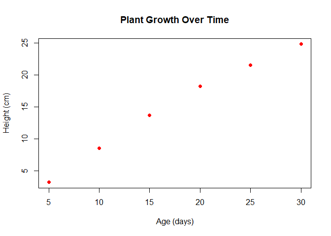
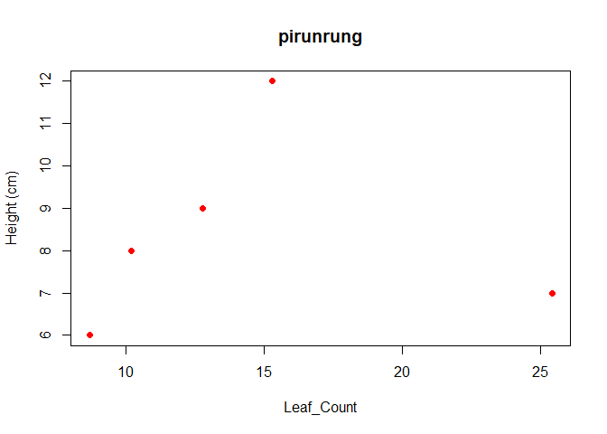
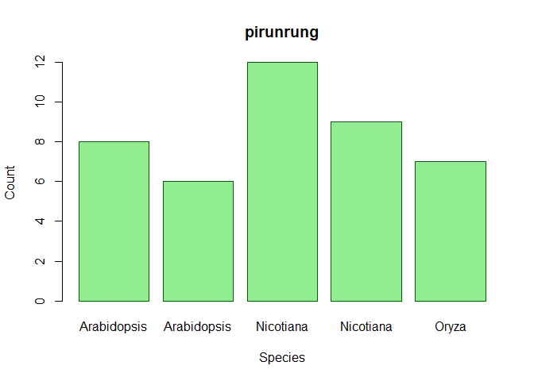
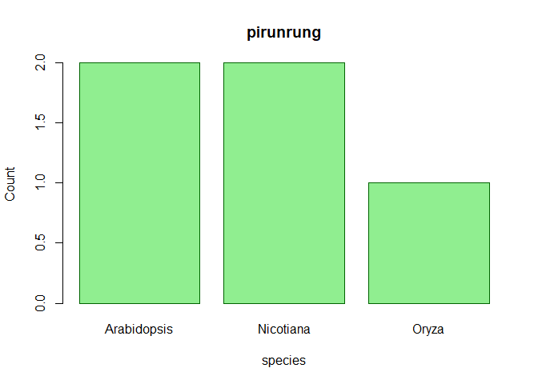
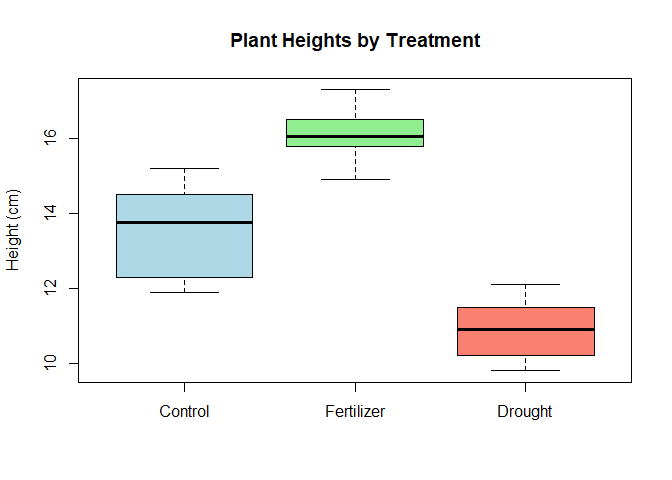

basic r
================
pirunrung
2025-05-02

``` r
plant_height <- 10.5
leaf_count <- 25
plant_height
```

    ## [1] 10.5

``` r
weight <- 2.5
class(weight)
```

    ## [1] "numeric"

``` r
count <- 10L  
class(count)
```

    ## [1] "integer"

``` r
is_flowering <- "TRUE"
class(is_flowering)
```

    ## [1] "character"

``` r
# Create a vector of plant heights (cm)
heights <- c(10.2, 15.7, 12.3, 9.8, 11.5)
heights
```

    ## [1] 10.2 15.7 12.3  9.8 11.5

``` r
species <- c("Arabidopsis", "Nicotiana", "Oryza", "Zea", "Solanum")
species
```

    ## [1] "Arabidopsis" "Nicotiana"   "Oryza"       "Zea"         "Solanum"

``` r
heights
```

    ## [1] 10.2 15.7 12.3  9.8 11.5

``` r
heights[3] 
```

    ## [1] 12.3

``` r
heights[2:4]
```

    ## [1] 15.7 12.3  9.8

``` r
heights
```

    ## [1] 10.2 15.7 12.3  9.8 11.5

``` r
mean(heights)
```

    ## [1] 11.9

``` r
mean (c(2,3,4,5,6,7,8,9,10))
```

    ## [1] 6

``` r
median(heights)
```

    ## [1] 11.5

``` r
min(heights)
```

    ## [1] 9.8

``` r
max(heights)
```

    ## [1] 15.7

``` r
sum(heights)
```

    ## [1] 59.5

``` r
length(heights)
```

    ## [1] 5

``` r
treatments <- factor(c("Control", "Treatment A", "Treatment B", "Control", "Treatment A"))
treatments
```

    ## [1] Control     Treatment A Treatment B Control     Treatment A
    ## Levels: Control Treatment A Treatment B

``` r
treatments_2 <- (c("Control", "Treatment A", "Treatment B", "Control", "Treatment A"))
treatments_2
```

    ## [1] "Control"     "Treatment A" "Treatment B" "Control"     "Treatment A"

``` r
levels(treatments)
```

    ## [1] "Control"     "Treatment A" "Treatment B"

``` r
table(treatments)
```

    ## treatments
    ##     Control Treatment A Treatment B 
    ##           2           2           1

``` r
experiment <- data.frame(
  Plant_ID = 1:5,
  Species = c("Arabidopsis", "Arabidopsis", "Nicotiana", "Nicotiana", "Oryza"),
  Treatment = c("Control", "Drought", "Control", "Drought", "Control"),
  Height = c(10.2, 8.7, 15.3, 12.8, 25.4),
  Leaf_Count = c(8, 6, 12, 9, 7)
)
experiment
```

    ##   Plant_ID     Species Treatment Height Leaf_Count
    ## 1        1 Arabidopsis   Control   10.2          8
    ## 2        2 Arabidopsis   Drought    8.7          6
    ## 3        3   Nicotiana   Control   15.3         12
    ## 4        4   Nicotiana   Drought   12.8          9
    ## 5        5       Oryza   Control   25.4          7

``` r
experiment <-data.frame(
  Plant_ID <-c(1,2,3,4,5),
  Species <-c("Arabidopsis", "Arabidopsis", "Nicotiana", "Nicotiana", "Oryza"),
  Treatment <-c("Control", "Drought", "Control", "Drought", "Control"),
  Height <-c(10.2, 8.7, 15.3, 12.8, 25.4),
  Leaf_Count <- c(8, 6, 12, 9, 7)
)
experiment <-data.frame(Plant_ID,Species,Treatment,Height,Leaf_Count)
```

``` r
tmp<-experiment$Plant_ID
```

``` r
experiment[2:3,]
```

    ##   Plant_ID     Species Treatment Height Leaf_Count
    ## 2        2 Arabidopsis   Drought    8.7          6
    ## 3        3   Nicotiana   Control   15.3         12

``` r
experiment[,2:3]
```

    ##       Species Treatment
    ## 1 Arabidopsis   Control
    ## 2 Arabidopsis   Drought
    ## 3   Nicotiana   Control
    ## 4   Nicotiana   Drought
    ## 5       Oryza   Control

``` r
experiment[c(2,4,2,3)]
```

    ##       Species Height   Species.1 Treatment
    ## 1 Arabidopsis   10.2 Arabidopsis   Control
    ## 2 Arabidopsis    8.7 Arabidopsis   Drought
    ## 3   Nicotiana   15.3   Nicotiana   Control
    ## 4   Nicotiana   12.8   Nicotiana   Drought
    ## 5       Oryza   25.4       Oryza   Control

``` r
experiment$Species
```

    ## [1] "Arabidopsis" "Arabidopsis" "Nicotiana"   "Nicotiana"   "Oryza"

``` r
summary(experiment)
```

    ##     Plant_ID   Species           Treatment             Height     
    ##  Min.   :1   Length:5           Length:5           Min.   : 8.70  
    ##  1st Qu.:2   Class :character   Class :character   1st Qu.:10.20  
    ##  Median :3   Mode  :character   Mode  :character   Median :12.80  
    ##  Mean   :3                                         Mean   :14.48  
    ##  3rd Qu.:4                                         3rd Qu.:15.30  
    ##  Max.   :5                                         Max.   :25.40  
    ##    Leaf_Count  
    ##  Min.   : 6.0  
    ##  1st Qu.: 7.0  
    ##  Median : 8.0  
    ##  Mean   : 8.4  
    ##  3rd Qu.: 9.0  
    ##  Max.   :12.0

``` r
experiment[1:3, c("Species", "Height")]
```

    ##       Species Height
    ## 1 Arabidopsis   10.2
    ## 2 Arabidopsis    8.7
    ## 3   Nicotiana   15.3

``` r
plant_data <- list(
  id = "AT001",
  species = "Arabidopsis thaliana",
  heights = c(10.2, 11.5, 9.8),
  is_model_organism = TRUE,
  germination_rates = data.frame(
    temperature = c(20, 25, 30),
    rate = c(0.82, 0.95, 0.78)
  )
)
```

``` r
plant_data$germination_rates
```

    ##   temperature rate
    ## 1          20 0.82
    ## 2          25 0.95
    ## 3          30 0.78

``` r
plant_data$germination_rates
```

    ##   temperature rate
    ## 1          20 0.82
    ## 2          25 0.95
    ## 3          30 0.78

``` r
plant_age <- c(5, 10, 15, 20, 25, 30)
plant_size <- c(3.2, 8.5, 13.7, 18.2, 21.5, 24.8)
# Create a basic scatter plot
plot(plant_age, plant_size, 
     main = "Plant Growth Over Time",
     xlab = "Age (days)",
     ylab = "Height (cm)",
     col = "red",
     pch = 16)  # pch controls the point shape
```

<!-- -->

``` r
plot(experiment$Height, experiment$Leaf_Count, 
     main = "pirunrung",
     xlab = "Leaf_Count",
     ylab = "Height (cm)",
     col = "red",
     pch = 16)  # pch controls the point shape
```

<!-- -->

``` r
# Create data for a bar plot
species_counts <- c(15, 23, 8, 12)
species_names <- c("Arabidopsis", "Nicotiana", "Oryza", "Zea")
experiment
```

    ##   Plant_ID     Species Treatment Height Leaf_Count
    ## 1        1 Arabidopsis   Control   10.2          8
    ## 2        2 Arabidopsis   Drought    8.7          6
    ## 3        3   Nicotiana   Control   15.3         12
    ## 4        4   Nicotiana   Drought   12.8          9
    ## 5        5       Oryza   Control   25.4          7

``` r
# Create a bar plot
barplot(experiment$Leaf_Count,
        names.arg = experiment$Species,
        main = "pirunrung",
        xlab = "Species",
        ylab = "Count",
        col = "lightgreen",
        border = "darkgreen")
```

<!-- -->

``` r
tmp<-table(experiment$Species)
tmp
```

    ## 
    ## Arabidopsis   Nicotiana       Oryza 
    ##           2           2           1

``` r
names (tmp)
```

    ## [1] "Arabidopsis" "Nicotiana"   "Oryza"

``` r
barplot(tmp,
        names.arg = names(tmp),
        main = "pirunrung",
        xlab = "species",
        ylab = "Count",
        col = "lightgreen",
        border = "darkgreen")
```

<!-- -->

``` r
# Create some data
treatment_A <- c(12.3, 14.5, 13.8, 15.2, 11.9, 13.7)
treatment_B <- c(15.8, 16.2, 14.9, 17.3, 16.5, 15.9)
treatment_C <- c(10.2, 11.5, 9.8, 10.5, 12.1, 11.3)


all_data <- list(
  "Control" = treatment_A,
  "Fertilizer" = treatment_B,
  "Drought" = treatment_C
)  
 
boxplot(all_data,
        main = "Plant Heights by Treatment",
        ylab = "Height (cm)",
        col = c("lightblue", "lightgreen", "salmon"))
```

<!-- -->

``` r
dat2<-data.frame("Control" = treatment_A,
  "Fertilizer" = treatment_B,
  "Drought" = treatment_C)
```

``` r
t_test_result <- t.test(dat2$Fertilizer, dat2$Control)
```

``` r
dat2
```

    ##   Control Fertilizer Drought
    ## 1    12.3       15.8    10.2
    ## 2    14.5       16.2    11.5
    ## 3    13.8       14.9     9.8
    ## 4    15.2       17.3    10.5
    ## 5    11.9       16.5    12.1
    ## 6    13.7       15.9    11.3

``` r
plant_growth <- data.frame(Height=c(dat2$Control,dat2$Fertilizer,dat2$Drought),
  Treatment=factor(rep(c("control","Fertilization","Drought"),each =6)))
```

``` r
plant_growth
```

    ##    Height     Treatment
    ## 1    12.3       control
    ## 2    14.5       control
    ## 3    13.8       control
    ## 4    15.2       control
    ## 5    11.9       control
    ## 6    13.7       control
    ## 7    15.8 Fertilization
    ## 8    16.2 Fertilization
    ## 9    14.9 Fertilization
    ## 10   17.3 Fertilization
    ## 11   16.5 Fertilization
    ## 12   15.9 Fertilization
    ## 13   10.2       Drought
    ## 14   11.5       Drought
    ## 15    9.8       Drought
    ## 16   10.5       Drought
    ## 17   12.1       Drought
    ## 18   11.3       Drought

``` r
plant_growth$Treatment
```

    ##  [1] control       control       control       control       control      
    ##  [6] control       Fertilization Fertilization Fertilization Fertilization
    ## [11] Fertilization Fertilization Drought       Drought       Drought      
    ## [16] Drought       Drought       Drought      
    ## Levels: control Drought Fertilization

``` r
anova_result <- aov(Height~Treatment,data = plant_growth)
```

``` r
tukey_result <- TukeyHSD(anova_result)
tukey_result
```

    ##   Tukey multiple comparisons of means
    ##     95% family-wise confidence level
    ## 
    ## Fit: aov(formula = Height ~ Treatment, data = plant_growth)
    ## 
    ## $Treatment
    ##                            diff       lwr       upr     p adj
    ## Drought-control       -2.666667 -4.165984 -1.167350 0.0009157
    ## Fertilization-control  2.533333  1.034016  4.032650 0.0014425
    ## Fertilization-Drought  5.200000  3.700683  6.699317 0.0000006
